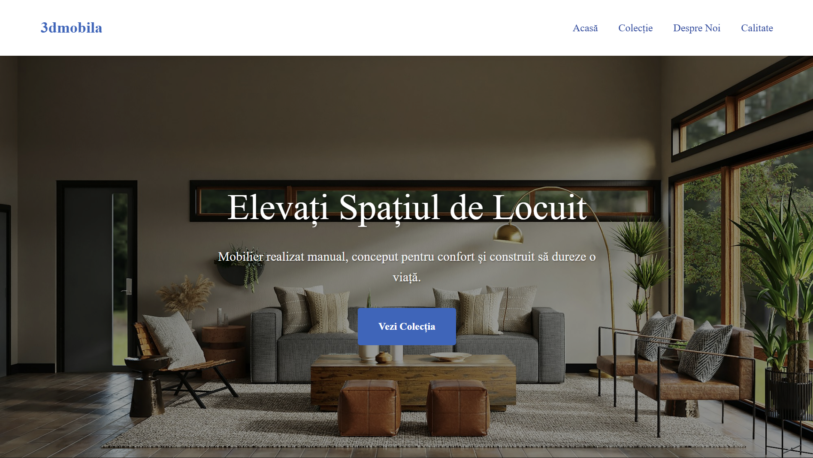
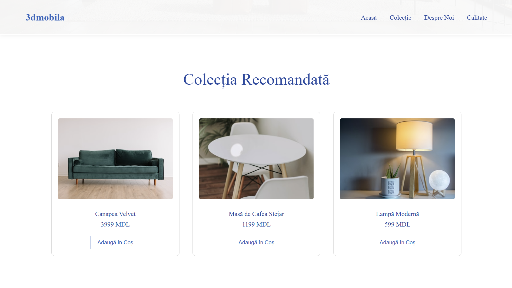
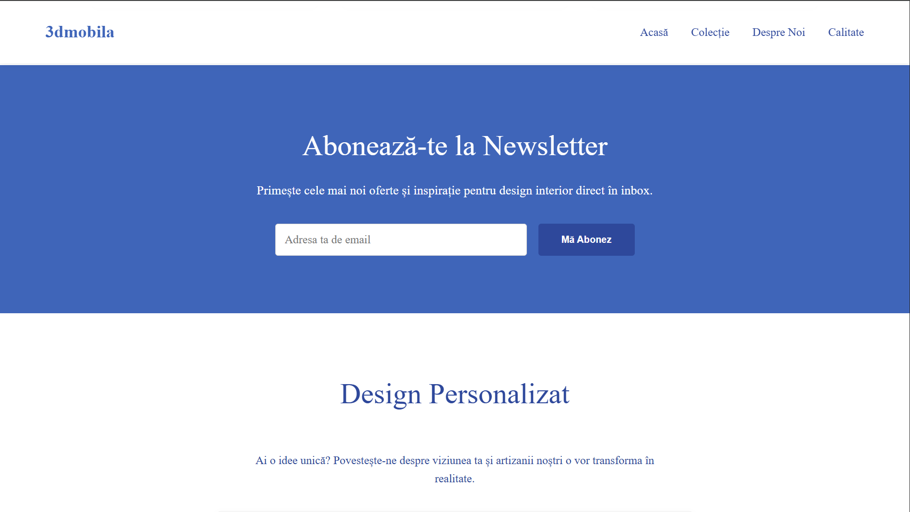
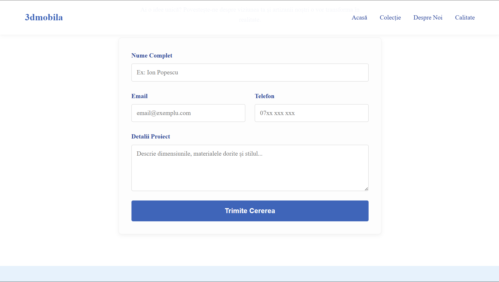
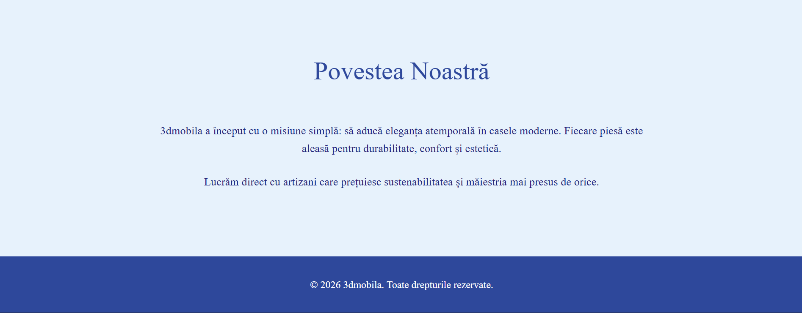

# 3dmobila - Modern Furniture Landing Page

A responsive landing page for "3dmobila", now migrated to a Static Site Generator (11ty) for better maintainability and content workflow.

## Features

- **Modern Navigation**: Sticky navigation bar for easy access to all sections.
- **Hero Section**: Strong call-to-action to engage visitors immediately.
- **Product Showcase**: A grid layout displaying featured furniture pieces.
- **Quality Assurance**: Dedicated section highlighting sustainability and craftsmanship.
- **About Section**: Story of the brand and its values.
- **Responsive Design**: Adapts to different screen sizes.

## Technologies

- HTML5
- CSS3 (Vanilla, custom variables, Flexbox & Grid)
- Eleventy (11ty)
- TailwindCSS CDN (for newsletter section utilities)

## Local Development

- Install dependencies: `npm install`
- Start dev server: `npm run dev`
- Build static output: `npm run build`

The generated site is written to `_site/`.

## CMS (Decap)

- Admin UI path: `/admin/`
- CMS config: `admin/config.yml`
- Editable section files: `src/_data/cms/*.json`

To use Decap CMS with GitHub backend, authenticate the deployed site with your Git provider and ensure `repo`/`branch` in `admin/config.yml` match your repository.

## Deployment

The site is automatically deployed to GitHub Pages on every push to the `master` branch via GitHub Actions.

- **Workflow**: `.github/workflows/deploy.yml`
- **Live Site**: [https://xnikug.github.io/tum-web-lab2/](https://xnikug.github.io/tum-web-lab2/)
- **Deployment Details**: See [DEPLOYMENT.md](DEPLOYMENT.md)

## Screenshots

### Hero Banner

### Collection

### Quality & Newsletter

### Custom Order Form

### Our Story

## Live Demo
[View Live Demo](https://xnikug.github.io/tum-web-lab2/)

